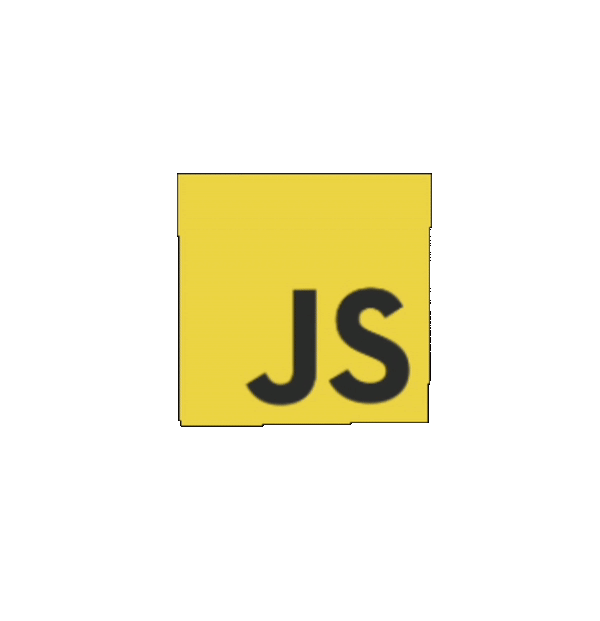

<h1>Hello there!</h1>

Experienced Front End Developer with 9 years of expertise in creating dynamic, high-performance web applications. Specialized in JavaScript frameworks, particularly NextJS and AlpineJS. Skilled in building responsive, user-friendly interfaces and optimizing web performance. Experienced in creating projects from scratch and building robust architectures as a Software Engineer. Also proficient in backend development. Focused on delivering solutions that are aligned with client expectations. 

## Skills & Technologies

                      

### Game Development
   

### Profiles
 